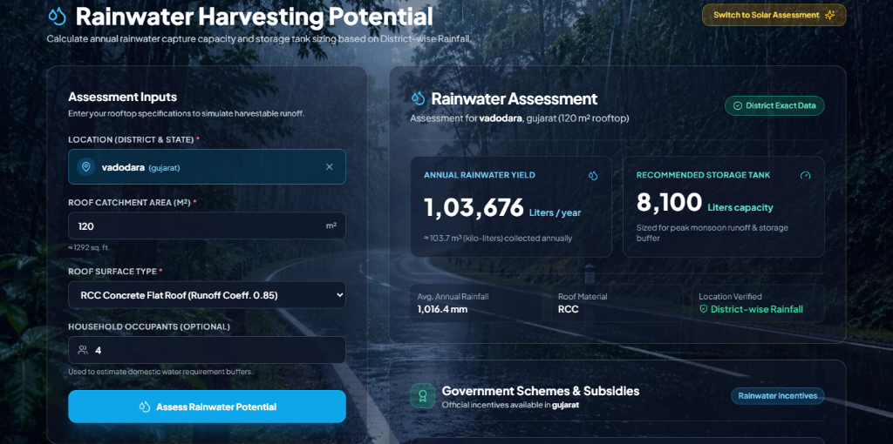
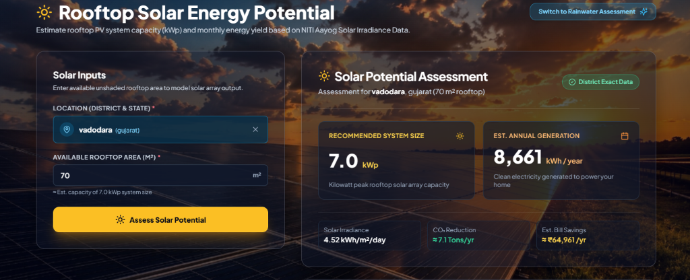

# 🌦️☀️ Meghaditya (मेघादित्य)

<div align="center">

### Rooftop Resource Assessment Tool for India

**Every rooftop in India sits on top of two untapped resources — rain and sunlight.**
**Meghaditya tells you exactly how much of each you're leaving on the table.**

[](https://react.dev/)
[](https://fastapi.tiangolo.com/)
[](https://tailwindcss.com/)
[](https://vitejs.dev/)
[](LICENSE)

[Live Demo](https://meghaditya.vercel.app/) · [Report a Bug](https://github.com/kunj2006-msu/meghaditya/issues) · [Request a Feature](https://github.com/kunj2006-msu/meghaditya/issues)

</div>

---

## 📖 The Idea

India has 700+ districts, each with wildly different rainfall and sunlight profiles — but almost no accessible tool lets an ordinary homeowner, architect, or small business quickly answer two simple questions:

> **"If I install a rainwater harvesting system on my roof, how much water will I actually get?"**
> **"If I install solar panels instead, how much power will I actually generate — and what will I save?"**

**Meghaditya** answers both, instantly, using real district-level meteorological data — no guesswork, no generic national averages, no vendor sales pitch. Just your location, your roof area, and a real number.

---

## 🌟 Key Features

| | |
|---|---|
| 💧 **Rainwater Harvesting Assessment** | Calculates annual harvestable runoff volume (liters/year), optimal storage tank sizing, and domestic demand coverage — factoring in your specific roof surface type (RCC concrete, tiled/sloped, or green roof) via real runoff coefficients. |
| ☀️ **Rooftop Solar Potential** | Estimates recommended PV system size (kWp), annual clean energy generation (kWh), projected utility bill savings (₹/year), and annual CO₂ emissions avoided. |
| 📊 **12-Month Generation Curve** | Interactive monthly solar irradiance breakdown (GHI, kWh/m²/day) so you can see *when* in the year your system performs best — not just a flat annual average. |
| 📜 **State Subsidy & Policy Finder** | Surfaces real, region-specific government incentive schemes (e.g. PM Surya Ghar Muft Bijli Yojana) and helpline numbers for both solar and rainwater harvesting — because knowing your potential is only half the picture. |
| 📄 **Branded PDF Report Export** | Server-side generated vector PDF reports (ReportLab) for both Rainwater and Solar assessments — featuring custom brand styling, metric callout boxes, 12-month solar irradiance bar charts, and clickable government portal links. |
| 🔍 **700+ District Search** | Full autocomplete coverage across every Indian state and union territory, with a state-level fallback for districts where fine-grained data isn't available. |
| ✨ **Dual-Theme Immersive UI** | Every dashboard visually transforms — cool, rain-drenched tones for the water assessment, warm golden light for the solar assessment — reinforcing what you're actually calculating. |

---

## 🎬 What It Looks Like

### 💧 Rainwater Harvesting Assessment Dashboard


### ☀️ Rooftop Solar Energy Potential Dashboard


### 📄 Assessment PDF Report Downloads (Examples)
- 💧 **Rainwater Assessment Report (PDF)**:(src/assets/megaditya-rainwater-report.pdf)
- ☀️ **Solar Potential Assessment Report (PDF)**:(src/assets/megaditya-solar-report.pdf)

---

## 🧠 How the Numbers Are Calculated

Meghaditya isn't a black box — every number traces back to a transparent, standard formula, not a machine-learning prediction:

**Rainwater Harvesting**
```
Harvestable Volume (L/year) = Avg. Annual Rainfall (mm) × Roof Area (m²) × Runoff Coefficient
```
Runoff coefficients: RCC concrete ≈ 0.85 · Tiled/sloped ≈ 0.8 · Green roof ≈ 0.4

**Rooftop Solar**
```
System Capacity (kWp)     = Roof Area (m²) ÷ 10
Annual Generation (kWh)   = Capacity (kWp) × Avg. Daily Irradiance (kWh/m²/day) × 365 × Performance Ratio (0.75)
```

This means every result is explainable and auditable — exactly what you'd want from a tool people are using to make real decisions about their homes.

---

## 🛠️ Technology Stack

### Frontend
- **React 18** (Vite 6) — component architecture & fast dev server
- **Tailwind CSS 3** + vanilla CSS keyframes — glassmorphic design system, staggered entrance animations
- **React Router DOM v6** — client-side routing between landing page and dashboards
- **Axios** — centralized API layer with extended timeout handling for cold-start resilience & blob handling for PDF downloads
- **Lucide React** — icon system

### Backend
- **FastAPI** (Python 3.10+) — async-ready REST API
- **ReportLab** — server-side vector PDF document engine & chart drawing
- **SQLAlchemy ORM** + **PostgreSQL (Supabase)** — relational data layer across 700+ districts
- **Pydantic v2** — request/response validation
- **Uvicorn** — ASGI server

### Infrastructure
- **Render** — backend hosting
- **Vercel** — frontend hosting

---

## 📁 Project Architecture

```text
meghaditya/
├── src/                            # React Frontend
│   ├── assets/                     # Background imagery, logo, branding assets
│   ├── components/
│   │   ├── LocationSearch.jsx      # Autocomplete search across 700+ districts
│   │   ├── Navbar.jsx              # Glassmorphic nav with mobile drawer
│   │   ├── PageBackground.jsx      # Fixed background layer, optional Ken Burns zoom
│   │   ├── ResultCard.jsx          # Assessment metric display card
│   │   ├── SplashScreen.jsx        # One-time animated session entry
│   │   └── SubsidyPanel.jsx        # State-wise subsidy & policy reference
│   ├── hooks/
│   │   └── useApiRequest.js        # Centralized fetch hook w/ cold-start-aware messaging
│   ├── pages/
│   │   ├── LandingPage.jsx         # Staged entrance hero + dual dashboard entry
│   │   ├── RainwaterDashboard.jsx  # Rainwater assessment workspace (with PDF export)
│   │   └── SolarDashboard.jsx      # Solar assessment workspace (with PDF export)
│   ├── App.jsx                     # Root app + router
│   └── config.js                   # API_BASE_URL configuration
│
├── backend/                        # FastAPI Backend
│   ├── app/
│   │   ├── models.py               # SQLAlchemy schemas
│   │   ├── schemas.py              # Pydantic request/response models
│   │   ├── crud.py                 # Query logic + calculation formulas
│   │   ├── pdf_generator.py        # ReportLab vector PDF generator & bar chart drawing
│   │   ├── database.py             # DB session/connection management
│   │   ├── main.py                 # App init, CORS, router registration
│   │   └── routers/                # /assess, /export/pdf, /locations, /subsidies endpoints
│   └── requirements.txt
│
├── package.json
├── tailwind.config.js
└── vite.config.js
```

---

## 🚀 Quick Start

### Prerequisites
- Node.js v18+ and npm v9+
- Python 3.10+
- A PostgreSQL database (Supabase recommended)

### 1. Clone the repo
```bash
git clone https://github.com/your-username/meghaditya.git
cd meghaditya
```

### 2. Backend setup
```bash
cd backend
python -m venv venv
source venv/bin/activate        # Windows: venv\Scripts\activate
pip install -r requirements.txt
```

Create a `.env` file in `backend/`:
```env
SUPABASE_DB_URL=postgresql://postgres:<password>@db.<project>.supabase.co:5432/postgres
```

Run the API:
```bash
uvicorn app.main:app --reload --port 8000
```
API docs available at `http://localhost:8000/docs`.

### 3. Frontend setup
```bash
cd ..
npm install
```

Update `src/config.js` to point at your running backend:
```js
export const API_BASE_URL = "http://localhost:8000";
```

Start the dev server:
```bash
npm run dev
```
App runs at `http://localhost:5173`.

---

## 🔌 API Overview

| Endpoint | Method | Description |
|---|---|---|
| `/locations/search?q={query}` | GET | Autocomplete search across state/district names |
| `/assess/rainwater` | POST | Rainwater harvesting calculation for a given location + roof spec |
| `/assess/solar` | POST | Solar potential calculation for a given location + roof area |
| `/export/pdf/rainwater` | POST | Generate and stream branded vector PDF report for rainwater harvesting |
| `/export/pdf/solar` | POST | Generate and stream branded vector PDF report for rooftop solar potential |
| `/locations/{location_id}/solar-monthly` | GET | 12-month irradiance breakdown for the solar generation chart |
| `/subsidies?type={rainwater\|solar}&state={state}` | GET | Government scheme & helpline directory |
| `/health` | GET | Lightweight health check (used for cold-start warm-up pings) |

Full interactive documentation is auto-generated via FastAPI at `/docs`.

---

## 🌐 Data Sources & Methodology

- **Rainfall**: District-wise annual rainfall statistics across 700+ Indian districts.
- **Solar Irradiance**: NITI Aayog solar irradiance data (annual + monthly average daily GHI, kWh/m²/day).
- **Subsidies**: Compiled from central and state government incentive programs, including PM Surya Ghar Muft Bijli Yojana and state-specific rainwater harvesting mandates.
- **Data reconciliation**: District names across the two source datasets were cross-matched and normalized (handling renamed districts, spelling variants, and state-boundary changes) to ensure consistent joins; districts without exact matches fall back to a state-level average, clearly flagged in the UI.

---

## 🗺️ Roadmap

- [ ] Add historical rainfall trend visualization (multi-year, not just annual average)
- [x] Add PDF export of assessment reports (server-side vector generation via ReportLab)
- [ ] Support multi-roof / multi-building batch assessments
- [ ] Localization (Hindi + regional language support)

---

## 🤝 Contributing

Contributions, issues, and feature requests are welcome. Feel free to check the [issues page](https://github.com/kunj2006-msu/meghaditya/issues) or open a pull request.

---

## 📄 License

This project is open source and available under the [MIT License](LICENSE).

---

<div align="center">

**Meghaditya** — *know what your roof can give you.*

</div>